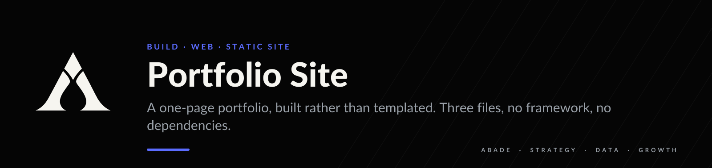
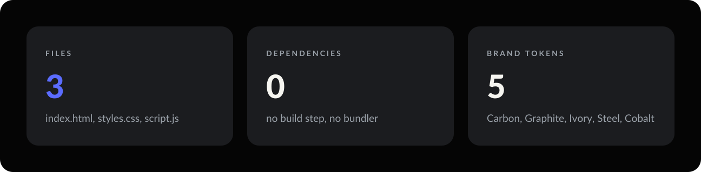
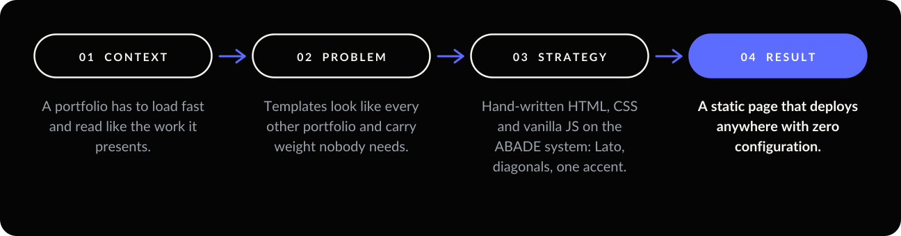
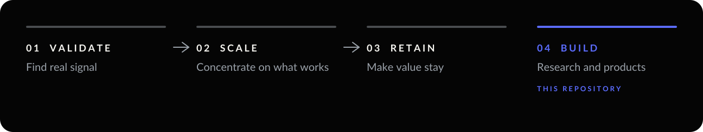

<p align="center"></p>

<p align="center">
  
  
  <a href="https://arielabade.github.io/abade/"></a>
</p>

**A one-page portfolio, built rather than templated.** Three files, no framework, no build step, on
the same visual system as every repository in this portfolio.

<p align="center"></p>

<p align="center"></p>

---

## 01 — Context

A portfolio has to load fast, work on a phone, and read like the work it presents.

## 02 — Problem

Templates look like every other portfolio and carry dependencies nobody needs.

## 03 — Strategy

Hand-written `index.html`, `styles.css` and `script.js` on the ABADE system. The structure, interaction
model and editorial pacing are inspired by `aelradi.engineer`. The markup, styles, scripts, copy and
graphic elements are original.

| Token | Hex | Role |
| --- | --- | --- |
| Carbon | `#050505` | Page background and deep surfaces |
| Graphite | `#1B1C1F` | Cards and secondary surfaces |
| Ivory | `#F6F5F0` | Primary text |
| Steel | `#7E8791` | Metadata, labels, support |
| Cobalt | `#5B6CFF` | The single accent |

One family, **Lato**, with microcopy in uppercase and wide tracking. Diagonal hairlines replace
perspective grids, because diagonals suggest progression and the system avoids futuristic grids as
ornament.

## 04 — Result

A static page that publishes directly to GitHub Pages, Netlify, Vercel or Cloudflare Pages with no
configuration. Live at [arielabade.github.io/abade](https://arielabade.github.io/abade/).

## 05 — Before publishing changes

| | Step |
| --- | --- |
| **01** | Replace `YOUR_EMAIL_HERE` in `index.html`. |
| **02** | Replace the monogram portrait placeholder with a photograph, if desired. |
| **03** | Point each project card at its real repository or case-study URL. |
| **04** | Add a LinkedIn URL to the contact area, if desired. |
| **05** | Review experience dates and wording. |

Steps 01 and 03 are blocking: a placeholder address and dead project links cost more credibility than
the page earns.

---

## Run it

```bash
git clone https://github.com/arielabade/abade
cd abade
python -m http.server 8080      # then open http://localhost:8080
```

Opening `index.html` directly also works.

## Repository map

```
index.html      structure and content
styles.css      ABADE tokens, layout, responsive rules
script.js       interactions, no dependencies
assets/brand/   README frame
```

---

<p align="center"></p>

<p align="center">
  <a href="https://github.com/arielabade">Portfolio</a>
</p>
