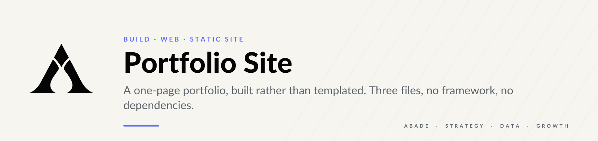

<p align="center">
  <picture>
    <source media="(prefers-color-scheme: dark)" srcset="assets/brand/header-dark.svg">
    
  </picture>
</p>

<p align="center">
  
  
  
</p>

**A one-page portfolio, built rather than templated.** Responsive, dependency-free, and written from
scratch — the interaction model and editorial rhythm are studied from a reference, the code and
content are original.

---

## 01 — What this is

A single-page portfolio build in three files and no framework: `index.html`, `styles.css`,
`script.js`. No build step, no bundler, no runtime dependencies.

The structure, interaction model and editorial pacing are inspired by `aelradi.engineer`. The markup,
styles, scripts, copy and graphic elements are original.

---

## 02 — Run locally

```bash
python -m http.server 8080
```

Then open `http://localhost:8080`. Opening `index.html` directly also works.

---

## 03 — Before publishing

| | Step |
| --- | --- |
| **01** | Replace `YOUR_EMAIL_HERE` in `index.html`. |
| **02** | Replace the monogram portrait placeholder with a photograph, if desired. |
| **03** | Point each project card at its real repository or case-study URL. |
| **04** | Add a LinkedIn URL to the contact area, if desired. |
| **05** | Review experience dates and wording. |

Steps 01 and 03 are blocking: a published page with a placeholder address and dead project links
costs more credibility than it earns.

---

## 04 — Deploy

The folder is static and publishes directly to GitHub Pages, Netlify, Vercel or Cloudflare Pages
with no configuration.

---

## 05 — Visual direction

The page runs on the portfolio's visual system.

| Token | Hex | Role |
| --- | --- | --- |
| Carbon | `#050505` | Page background and deep surfaces |
| Graphite | `#1B1C1F` | Cards and secondary surfaces |
| Ivory | `#F6F5F0` | Primary text |
| Steel | `#7E8791` | Metadata, labels, support |
| Cobalt | `#5B6CFF` | The single accent |

Typography is one family, **Lato**, with microcopy set in uppercase and wide tracking. Decorative
perspective grids were replaced with diagonal hairline fields: diagonals suggest progression, and the
system avoids futuristic grids as ornament. Layout, structure and interactions are unchanged.

---

<p align="center">
  <a href="https://github.com/arielabade">Portfolio overview</a>
</p>
